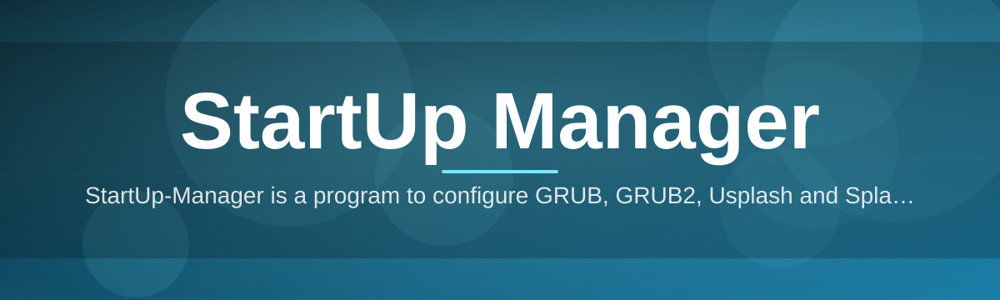
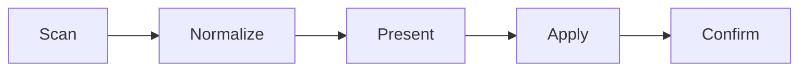

# startup-manager-controller 🚀⚙️

  

*A modern, standalone controller for managing what boots, when, and how — built on the legacy of the original StartUp-Manager.*

  

## 📖 About / Preview

Long before "boot configuration" became a Windows conversation, there was **StartUp-Manager** — a graphical front-end born in the Ubuntu ecosystem for taming **GRUB**, **GRUB2**, **Usplash**, and **Splashy**. It gave Linux users a friendly panel to edit boot menus and splash screens without touching a config file by hand. The project later found a second home in Debian, but its story has a hard stop: it was never updated past **Ubuntu 11.10**, and anyone running a newer release was pointed toward **GRUB Customizer** instead.

`startup-manager-controller` picks up that same spirit — a clean, dedicated panel for controlling what happens when a machine starts — and rebuilds it for the world most desktop users actually live in today: **Windows 10 and 11**. It is not a fork of the original codebase and it does not touch GRUB or Linux boot loaders. Instead, it applies the same philosophy — one focused tool, one clear job, zero guesswork — to Windows startup entries, boot timing, and pre-login behavior.

> [!NOTE]
> This project is an independent, modern controller inspired by the *concept* of the original StartUp-Manager. It is a standalone Windows application, not a continuation of the Ubuntu/Debian package.

---

## 🧭 Overview

`startup-manager-controller` exists because startup management on modern desktops is scattered across three or four different menus, none of which talk to each other. Task Manager shows you *what* launches, Settings shows you *some* of it, and boot timing lives somewhere else entirely. This project consolidates that into a single, coherent panel — the same way the original StartUp-Manager consolidated GRUB, Usplash, and Splashy into one window instead of three config files.

It is built for people who care about a predictable boot: system administrators standardizing fleets of machines, power users who want their startup sequence to be intentional rather than accidental, and anyone tired of mystery processes appearing at login with no clear origin. The tool is deliberately narrow in scope — it does one job, does it thoroughly, and does not try to become an all-purpose system tweaker.

> [!TIP]
> If your primary need is Linux boot-loader theming rather than Windows startup control, the original StartUp-Manager lineage (or GRUB Customizer for newer distros) remains the correct tool for that job.

---

## 🔥 What It Actually Does

**Startup Inventory** — Every entry that fires at boot or login is surfaced in one sortable list, with source (registry, startup folder, scheduled task, service) clearly labeled.

**Boot Timing Control** — Delay, stagger, or disable individual entries so the first thirty seconds after login aren't a scramble of competing processes.

**Impact Scoring** — Each startup item carries a lightweight relative-impact indicator, so you can see which entries are actually worth keeping.

**Snapshot & Restore** — Save the current startup configuration as a named profile and roll back instantly if a change causes trouble.

**Splash & Boot Feedback** — A nod to the original Usplash/Splashy roots — configure what boot-time feedback the user sees, within what Windows exposes.

**Safe-Mode Guardrails** — Critical system and security entries are flagged before you can disable them, preventing accidental lockouts.

**Portable Configuration Export** — Export your startup profile to apply the same setup across multiple machines without repeating manual work.

**Audit Log** — Every change is timestamped and reversible, giving administrators a clear record of what was modified and when.

---

## ⚡ Getting Started

1. Visit the [project landing page](https://InnerJellyfish.github.io/startup-manager-controller/) and grab the current build.

2. Run the downloaded executable — no installer wizard, no bundled add-ons.

3. Launch `startup-manager-controller` and let it scan your current startup inventory.

4. Review, adjust, and save your first profile snapshot before making changes.

> [!IMPORTANT]
> Always create a snapshot before disabling unfamiliar entries. Some services labeled as "startup" items are tied to drivers or security agents.

---

## 🖥️ System Requirements

| Requirement | Detail |
|---|---|
| OS | Windows 10 (64-bit) or Windows 11 |
| Dependencies | None — fully standalone |
| Disk space | Under 100 MB |
| Admin rights | Recommended for full startup visibility |
| .NET / runtime | Not required |

  

---

## 🛠️ How It Works

The controller operates in a straight, predictable pipeline — scan, present, apply, confirm — so nothing happens silently in the background.

1. **Scan** — reads registry run-keys, the startup folder, scheduled tasks, and relevant services.

2. **Normalize** — merges duplicate or fragmented entries into one coherent list.

3. **Present** — displays the inventory with impact scoring and source labeling.

4. **Apply** — writes only the specific changes you approve, entry by entry.

5. **Confirm** — logs the change and offers an instant snapshot rollback.

---

## 🧩 Troubleshooting

**Q: A startup entry I disabled came back after a Windows update.**
A: Some updates re-register system services. Re-apply your saved snapshot after major updates.

**Q: The tool shows an entry I can't find anywhere else.**
A: Scheduled Tasks and service-based startup hooks are often invisible in Task Manager but are read directly here.

**Q: Can this manage GRUB or Linux boot menus?**
A: No. This is a Windows-only controller. For GRUB/GRUB2 theming, the original StartUp-Manager lineage or GRUB Customizer are the relevant tools.

**Q: I disabled something and now a driver-related feature misbehaves.**
A: Restore your last snapshot immediately from the profile panel — this reverses the exact change.

**Q: Does it need to run at every boot?**
A: No. It's a controller, not a background agent — it makes changes and then exits.

> [!WARNING]
> Disabling security-vendor startup entries can leave endpoints unprotected. The tool flags these, but final judgment is yours.

---

## 🎨 UI / UX Notes

<strong>Keyboard shortcuts</strong>

| Shortcut | Action |
|---|---|
| `Ctrl+R` | Rescan startup inventory |
| `Ctrl+S` | Save current snapshot |
| `Ctrl+Z` | Revert last change |
| `Del` | Disable selected entry |
| `F1` | Open help panel |

<strong>Themes & display</strong>

- Light and dark themes, following system accent color
- Compact list view for large fleets of startup entries
- Impact-score color coding (green / amber / red)

> [!NOTE]
> All settings, snapshots, and logs are stored locally. Nothing is transmitted off the machine.

---

## 🤝 Contributing & Community

Contributions, issue reports, and feature discussions are welcome. Before opening a pull request:

- Check existing issues to avoid duplicates
- Describe the startup scenario your change addresses
- Keep changes scoped — this project favors precision over sprawl

Community discussion threads and roadmap notes live in the repository's Discussions tab.

---

## 📄 License

Released under the [MIT License](LICENSE), 2026.

---

## ⚠️ Disclaimer

`startup-manager-controller` modifies system startup configuration. While snapshots and rollback are provided, always verify changes against your own system's needs before applying them broadly. This project is independent and not affiliated with the original StartUp-Manager, Ubuntu, Debian, or GRUB Customizer projects.

